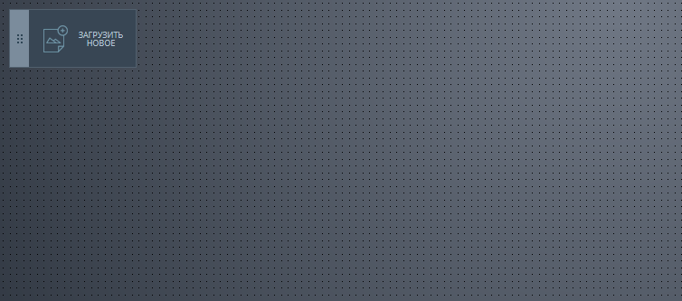

# Дипломный проект по теме "JavaScript в браузере"

Клиентская часть сервиса, позволяющего рецензировать изображения.

Сервис предоставляет пользователям следующие возможности:
- загружать изображения;
- добавлять комментарии к конкретной части изображения;
- рисовать поверх изображения.

А также сервис наделён элементами совместной работы:
- загруженное изображение имеет уникальную ссылку, которой можно поделиться;
- все пользователи, просматривающие изображение, уведомляются о новых комментариях к нему;
- все пользователи, просматривающие изображение в режиме рисования, видят, что рисуют другие пользователи.

Детальное описание задания - [здесь](https://github.com/Vigsterk/my-js-diploma/blob/master/README.md).

Попробовать сервис - [здесь](https://netology-code.github.io/hj-32-bubn0ff/).